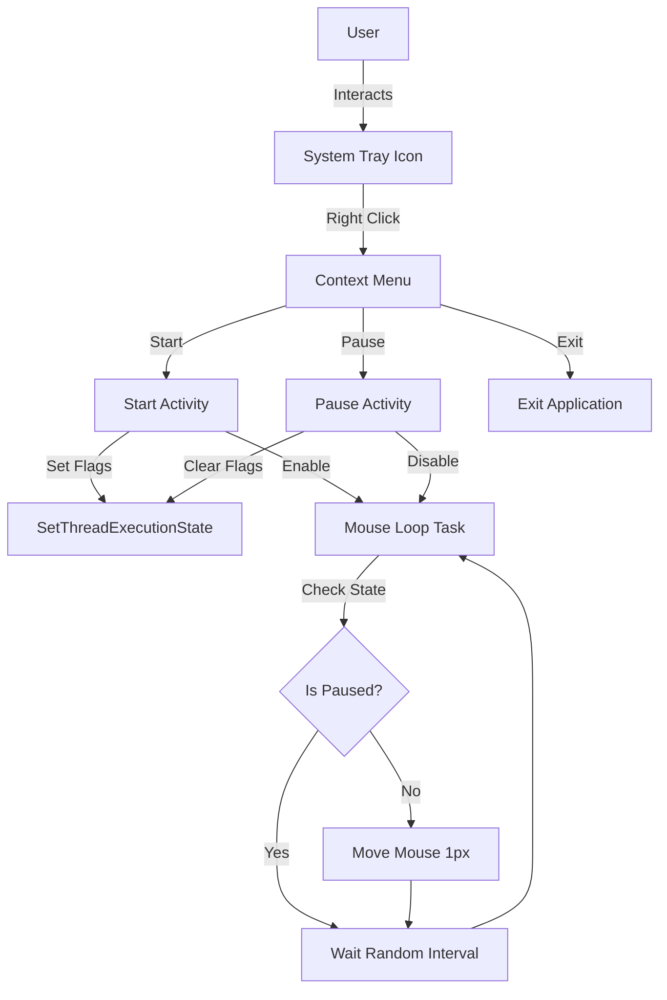

# Invisible Mouse Mover

A lightweight Windows System Tray application designed to keep your computer awake and active. It prevents the system from going to sleep or locking the screen by simulating subtle mouse movements and setting thread execution states.

## Features

- **System Tray Integration**: Runs silently in the background with a system tray icon.
- **Prevent Sleep**: Uses Windows API (`SetThreadExecutionState`) to prevent the system from entering sleep mode.
- **Simulated Activity**: Periodically moves the mouse cursor 1 pixel to simulate user presence.
- **Randomized Intervals**: Mouse movements occur at random intervals (between 30 and 90 seconds) to mimic natural behavior.
- **Controls**:
  - **Start**: Resume activity monitoring.
  - **Pause**: Temporarily stop activity monitoring without exiting.
  - **Exit**: Close the application.

## Architecture

The application is built using .NET 8.0 (Windows Forms) but operates primarily as an `ApplicationContext` without a visible main window.

### High-Level Overview



### Technical Details

- **Language**: C#
- **Framework**: .NET 8.0 Windows
- **Native APIs**:
  - `user32.dll`: `mouse_event` for cursor movement.
  - `kernel32.dll`: `SetThreadExecutionState` for power management.

## Getting Started

### Prerequisites

- Windows OS
- .NET 8.0 Runtime

### Installation

1. Clone the repository.
2. Build the solution using Visual Studio or the .NET CLI.
   ```powershell
   dotnet build
   ```
3. Run the executable.

### Usage

1. Launch the application.
2. A shield icon will appear in the system tray.
3. Right-click the icon to access the menu.
4. Select **Pause** to stop the mouse movements temporarily.
5. Select **Start** to resume.
6. Select **Exit** to close the application completely.

## License

[MIT License](LICENSE)
